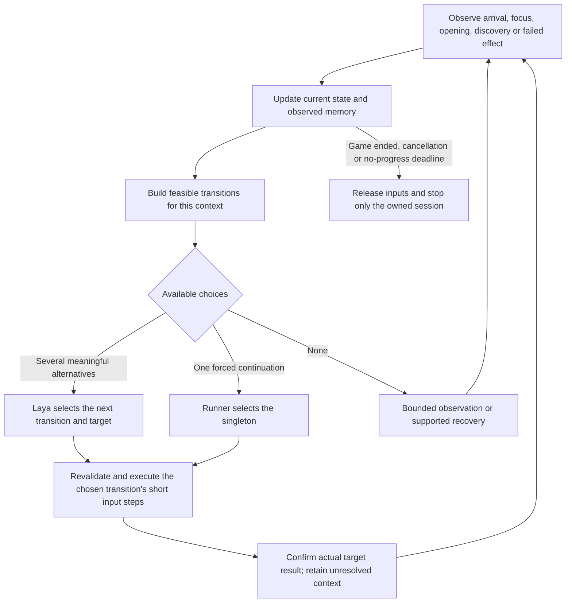

# Autonomous playtest PoC: implementation, evidence and remaining acceptance

Consolidated 2026-10-07 from recorded runs through 2026-10-06. This is a retrospective,
not a fresh Studio inventory or a new gameplay run. Studio may have changed since
the last recorded readback. Read the installed source/hash before resuming.

## Conclusion

The Diligent -> editable game adapter -> Laya choice -> real Studio input ->
correlated feedback loop is implemented and has been exercised. A raid adapter
won real episodes; that does not establish automatic adaptation or reliable play
for arbitrary UGC. Horror exploration remains unreliable. Its final grouped
inspection implementation was saved and validated, but the last episode never
offered an inspection candidate. **Final grouped drawer completion is unverified.**

No remote Jev account/provider was exercised. The measured decision provider was
native Ollaya/Laya. Neither XState nor a reactive-state library is a prerequisite;
neither supplies game-specific observations, input semantics or trustworthy goals.

For a concrete explanation, start with [the object-to-choice walkthrough](#walkthrough-how-a-game-object-becomes-a-model-choice).
Then read [the state-machine and decision-boundary explanation](#what-the-state-machine-does-and-when-laya-chooses),
including its Mermaid diagram and conceptual statechart, before interpreting the
recorded test results.

## Where the implementation lives

| Component | Responsibility / source |
| --- | --- |
| Diligent authoring | Inspect current Lua/GUI, derive bindings and test inventory, maintain Studio source, inspect bounded real runs. [Bundled skill](../../apps/overdare-ai-agent/bootstrap/skills/autonomous-playtest/SKILL.md). |
| Game adapter | Editable `ReplicatedStorage.DiligentPlaytestHarnesses.<name>`; facts, target bindings, candidates, input steps, memory and real outcome predicates. |
| Managed driver | `StarterPlayerScripts.DiligentPlaytestDriver_<name>` publishes JSON from `start()`/`observe()`. No model-choice callback. |
| Shared runner | [Playtest tools](../../apps/overdare-ai-agent/sidecar/src/tools/studiorpc/tools/playtest/): observation, model requests, current intent, fresh dispatch checks, effects, watchdog, trace and owned-session cleanup. |
| Decision model | Receives goal, `decisionState` (or full state if omitted), candidate descriptions and short runner context; returns an available choice ID. Does not read arbitrary Lua or generate input code per decision. |

The implementation uses the existing tool protocol for Web, TUI and MCP. Python
experiments from the original local `scripts/jev-playtest-poc/` archive are not a
runtime dependency. This PR includes only selected evidence and its index; the
experimental runners and full raw archive remain local. The [product guide](../guide/play-test-input.md) describes current
contracts; design notes and archived adapters are not installation instructions.

## Mapping a meaningful choice

```text
actual interaction ID + binding lifecycle
  -> stable alias within the episode
  -> observed local state and prerequisites
  -> semantic candidate such as inspect:<alias>
  -> current physical step: approach / focus / input / bounded wait or recovery
  -> exact recipient + authoritative target feedback
  -> completed goal, updated memory and next alternatives
```

The game-specific adapter identifies resources and their role from game code and
metadata. A Battery filter in Horror is authored game knowledge, not Laya visually
discovering the objective or a universal item rule. Hidden/unloaded facts remain
unknown under the selected observation scope.

The last recorded Horror adapter enables `combineApproachAndOpen=true`: one inspect
intent retains its target through mechanical substeps. Other targets, collectibles
and leave/return alternatives remain. This was an experimental response to repeated
focus-only choices, not proof that this is the only appropriate decision boundary
or that the grouped behavior succeeded live.

The supplied design discussion ends with a different clarification: **Laya should
choose the next transition at meaningful observed events**, including arrival and
focus confirmation when those are intended decision points. The event-level design
and the last saved grouped-inspection mode are distinguished below. This document
update does not switch the installed adapter's mode or implement an XState machine.

Runner memory is current intent plus three recent physical outcomes. Adapter
memory is observed target/room/item outcomes. Native input events do not create
an `onDecision` callback, and publishing a candidate is not choosing it.

## Walkthrough: how a game object becomes a model choice

Think of the harness as a small game-specific program prepared by Diligent. Diligent
reads the relevant game code and writes the bindings and rules before play. During
play, those rules run on current observations; Laya chooses among their outputs.
Diligent can later revise the program from a failed trace. It does not generate
new Lua on every gameplay decision.

### 1. Give a real object a stable identity

The game already has an interaction registry, objects and prompts. In the recorded
Horror adapter, Diligent used the controller's `wrappersById` entries and their
anchor/prompt bindings. A drawer's identity is more specific than its furniture's
name: top, middle and bottom anchors are separate targets.

```text
Actual game ID:
  APT_1F/Pivot_101/2/Dresser_001/ProximityBottomSlideAnchor

Episode-local alias:
  t7                         # illustrative; not a permanent cross-run ID

Separate transition IDs:
  approach:t7 / focus:t7 / open:t7

Optional grouped goal ID:
  inspect:t7
```

The alias points back to the actual object and binding lifecycle. The words in a
candidate description are not interpreted later to find a vaguely matching drawer.
Two objects named "Dresser" or two controls using E remain different bindings.

### 2. Read enough state to distinguish the next actions

The following is an illustrative situation, not a claim about the currently open
Studio scene:

| Target | Observed context | Why the distinction matters |
| --- | --- | --- |
| Upper drawer | Server says open; battery revealed but uncollected; container prompt hidden; item prompt shown | Offer the available item interaction rather than assuming the container can be closed now. |
| Middle drawer | Open, item already collected | Closing is an option only if its real prompt permits it. |
| Lower drawer | No server reply yet; client says closed; uninspected; another anchor has focus | Server state is unknown, not confirmed closed. Acquisition of the correct focus may be the next transition. |

Position and range, native focus, GUI visibility/action text, cooldown or animation,
prerequisites, previous observed outcomes and shared-key recipients can all affect
availability. Do not invent "close the upper drawer first" unless the game code or
observed geometry establishes that dependency.

There are two observation stages. The Lua adapter's `observe()` interprets live
objects and cached game feedback into state/candidates. The common driver publishes
that frame, and the runner retrieves it through `game.observe` RPC. The RPC is the
transport for this game-specific interpretation; it does not independently discover
what a drawer, battery or successful mission means. A fresh driver frame also does
not prove every cached server fact is fresh.

### 3. Generate choices from state, rather than a fixed itinerary

Diligent writes rules connecting the game's objects to legal actions and evidence.
At runtime the adapter enumerates the relevant objects and applies those rules:

| Observed condition | Example transition | Physical implementation | Completion evidence |
| --- | --- | --- | --- |
| Target outside usable range | Approach lower drawer | Bounded navigation inputs | Actual arrival in the required region/range |
| Wrong focused anchor | Focus lower drawer | Bounded camera gesture | Correct native target/focus, with remaining readiness conditions kept explicit |
| Closed target with an eligible prompt | Open lower drawer | Its supported key/hold or GUI input | Fresh opening feedback for this target, correlated with the input recipient |
| Revealed mission item is usable | Collect battery | The item's supported input | Target item receipt and appropriate inventory change |
| A reachable exit is available | Leave room | Physical route to the exit | Observed arrival outside the room, not merely a streaming notification |

These are state-dependent alternatives, not a mandatory five-action sequence. The
opened drawer might lead to collection, another drawer, or leaving. The adapter's
game-specific `itemType == "Battery"` check supplies the item's mission role from
code/metadata; Laya has not discovered that role from pixels. Another UGC needs its
own resource, prerequisite and objective bindings.

### 4. Attach executable steps and checks to a choice ID

For a separate open transition, a simplified representation of the existing frame
contract looks like this. Names and durations below are illustrative; derive them
from the actual target and current tool contract.

```lua
-- state contains the actual target's observations and persistent counters.
local checks = {
    {key = "opened.t7", op = "equals", value = true},
    {key = "feedbackVersions.t7", op = "increase"},
    {key = "recipientSerial.t7", op = "increase"},
}

local step = pressUsingActualPromptBinding(target.prompt) -- creates an input batch
step.intent = {
    id = "open:t7",
    description = "Open the lower drawer; exact prompt is ready",
    validityKey = target.actualId .. ":load:" .. target.generation,
    completeWhen = checks,
}
step.expectations = checks
-- Publish step; constructing it does not send the input or select the target.
```

`pressUsingActualPromptBinding` is an explanatory helper name, not a new tool API.
The implementation uses its own `press`/`wrap` helpers. In grouped mode the intent
is `inspect:t7` and its current physical step can instead be navigation, focus or
bounded waiting. The semantic ID stays stable across those steps.

The runner presents the intent ID and description to Laya, or the ordinary action
ID/description when intent metadata is absent. An abbreviated decision view might
say "room 101, carrying 0, one revealed battery, lower drawer uninspected" and offer
`collect:t8`, `focus:t7`, and `leave_room`. Laya returns one available ID. The runner
looks up the corresponding current step, revalidates it against the latest frame
and executes its balanced input events. It does not evaluate model-written Lua or
turn the natural-language description into arbitrary commands.

For forward movement in the recorded adapter, `Nav.step()` computes a waypoint,
turns toward it when necessary, then holds W for a distance/speed-derived interval
of 150-600ms under that profile and observes the actual displacement. Camera
alignment computes angle error and converts it to a bounded drag. Those are this
game's executor mechanics, not universal movement controls or a model decision
on each key-down frame.

### 5. Verify what actually happened

```text
selected lower drawer
  != input received by lower drawer
  != lower drawer confirmed open
```

Join the runner's decision/dispatch with native recipients and fresh authoritative
feedback. E can reach multiple prompts: opening the selected drawer and collecting
an unrelated battery in the same input is a selected open effect plus an incidental
collection, not two model choices. Keep result counters in full state even when
candidate sorting removes the completed target.

The runner retains the chosen intent and its baseline; Lua remembers observed
visits, openings and receipts. Neither publishing a candidate nor successful input
delivery should record a completed game action. The runner's three recent physical
outcomes are also not a durable history of every semantic attempt.

## What the state machine does, and when Laya chooses

The state-machine role is to maintain context, determine guarded transitions and
advance from evidence. It is not the policy that chooses every next task. Context
includes current room, object identity/lifecycle, intended transition, current
mechanical phase, native focus/GUI, outstanding prerequisites and observed results.
In the present implementation those responsibilities are split between ordinary
Luau state/conditions and the runner's retained intent, not an installed XState actor.

The supplied discussion distinguishes two possible decision boundaries:

| Boundary | Laya decides | Executor retains | Status in this PoC |
| --- | --- | --- | --- |
| Meaningful event / transition | After arrival, focus confirmation, opening, item discovery or failed effect, choose the next available transition | The currently chosen move, focus, open or collect transition until its own completion/invalidation | The final clarification in the supplied discussion; earlier traces contain separate approach/focus/open choices. |
| Grouped target inspection | Choose which drawer to inspect, then reconsider at completion, invalidation or the configured interval | Approach, focus, input and verification for that selected drawer | Last saved experimental mode (`combineApproachAndOpen=true`); its final episode did not exercise inspection. |

**An event-level design does not call Laya on every raw event, heartbeat or W-key
frame.** Update facts from observations, coalesce relevant changes, and reconsider
at meaningful decision boundaries. Zero candidates require observation/recovery;
the current runner executes a singleton without a model call. While an intent is
retained, the runner can keep sending its next step until completion, invalidation
or periodic reconsideration. The recorded 8-second interval is checked at input
boundaries, not a guarantee of immediate interruption during an input batch.

Top-level frame `events` are feedback logs, not an implemented event bus that calls
Laya for every game notification. Describing `INSPECT(target)` as a decision event
and `OPEN_CONFIRMED(target)` as an observation event is useful design notation;
it does not mean Lua receives a model-choice callback. Event-level behavior must
be expressed in the actual candidates, intent completion and runner contract.

### Event-level diagram: the clarification from the discussion



For example, arrival at the drawer creates a choice between focusing the lower
drawer, focusing the upper one and leaving. Confirmed lower-drawer focus creates
a choice between opening it, changing targets and leaving. Confirmed opening
creates a choice between collecting a revealed item, inspecting another drawer
and leaving. Missing or mismatched feedback creates recovery context, not an
assumption that the intended action succeeded.

### XState-style statechart sketch (proposal, not installed code)

This is library-neutral pseudocode using hierarchical statechart concepts familiar
from XState. It is not executable XState configuration, a verified SDK example or
a claim that these actor/helper APIs exist in the current repository. An XState
implementation would need real observation subscriptions, cancellation and adapter
bindings; the current Lua/runner split can express the same responsibilities.

```text
machine Play
  context: world, observedMemory, candidates, activeTransition, baseline, deadline

  on fresh OBSERVED:
    update world and observedMemory          // never overwrite newer facts
  on GAME_ENDED, CANCELLED or STUCK:
    go to stopped                           // applies during choosing and execution

  state deciding:
    build candidates from current facts and the user's objective
    if none: enter a bounded observation/recovery path
    if one: select the forced continuation using the same choice handling below
    otherwise: invoke Laya with compact state and candidate IDs/descriptions
    on returned choice:
      if no longer available: rebuild and decide again
      else: retain choice + real binding + observation baseline
            go to executing.checking

  state executing:                          // active target survives inner steps
    state checking:
      if chosen transition's actual result confirmed: go to confirmed
      if target invalid or supported recovery exhausted: go to recovering
      if observed animation/cooldown pending: go to waitingForReady
      otherwise dispatch by the CHOSEN transition:
        APPROACH -> moving
        FOCUS    -> focusing
        OPEN, COLLECT, CLOSE -> acting only when their guards are satisfied

    state moving or focusing:
      issue one bounded input step; observe again
      if this chosen transition's result is confirmed: go to confirmed
      if blocked or deadline exceeded: go to recovering
      otherwise continue this same transition

    state waitingForReady:
      on relevant observation: recheck readiness
      on the existing readiness deadline: go to recovering
      // repeated observations must not renew the same deadline

    state acting:
      revalidate target, focus, GUI, range and competing recipients
      dispatch a balanced input batch
      on input completion: go to verifying  // NOT directly to confirmed

    state verifying:
      on fresh observation: check target/player/lifecycle/receipt correlation
      if the chosen effect is confirmed: go to confirmed
      if evidence contradicts it or the result deadline expires: go to recovering
      otherwise keep observing within that deadline

  state confirmed:
    record the observed outcome; clear the completed transition
    go to deciding                          // FOCUS completion does not auto-select OPEN

  state recovering:
    retain the observed failure/unknown and build real recovery alternatives
    go to deciding                          // reposition / retry / another target / leave

  state stopped:
    release inputs; verify and stop only the session owned by this run
```

The grouped `INSPECT` variant changes the boundary inside `executing`: arrival
or focus confirmation advances to its next internal check, and only the selected
drawer's confirmed opening finishes the inspect goal. It must still retain real
alternatives at supported reconsideration points. This is the alternative shown
earlier in the supplied discussion, not the same as asking Laya after every arrival
and focus event.

The sketch's `verifying` state describes a bounded evidence-aware design. The
implemented runner checks step effects on the first newer post-input frame and
records failures; intent completion is checked separately on subsequent frames.
It does not automatically provide the sketch's complete recovery policy. Similarly,
the shared no-progress watchdog is not a fresh timer on each substate entry: only
actual meaningful progress and supported bounded-wait semantics govern it.

### Why the oscillation examples are different

In one recorded case an opened drawer's item prompt replaced its container prompt.
The adapter still offered container focus, then dropped the candidate after aiming.
That is an incorrect local-state/availability mapping. In another case focus
actually completed and opening was available, but Laya chose the other focus again.
That is a policy/decision-granularity problem. Adding memory, increasing model-call
frequency or grouping actions are not interchangeable fixes for these two cases.
The evidence sections below retain their separate outcomes; these explanatory
diagrams and pseudocode do not turn the final unexercised path into a passed test.

## Evidence by stage

| Stage | Observed result | What it does not establish |
| --- | --- | --- |
| Windows Python raid experiments | Recorded victories and latency probes. [Historical report](../../scripts/jev-playtest-poc/evidence/repeat-report.html). | Production integration, remote Jev quality, or universal latency/FPS. |
| Native raid + Diligent maintenance | Direct native and maintained adapter both reached real victory; maintained run ended boss HP 0/player HP 125, 24 Laya choices, owned cleanup. [Report](../../scripts/jev-playtest-poc/evidence/native/integration-report.txt), [summary](../../scripts/jev-playtest-poc/evidence/native/agent-native-summary.json). | Unassisted first-time UGC adaptation or a controlled model-quality/win-rate comparison. |
| HexFall repair | Final gameplay revision exercised 9/11 declared targets; single intended landings 2/18 and double landings 6/16. Deadline classification defect was separately repaired and probed. [Repair report](../../scripts/jev-playtest-poc/evidence/session-repair/repair-report.txt). | Victory, final match result or 81.8% reliability. The original pre-fix error summary remains preserved. |
| Horror earlier transitions | A real collect -> leave -> deposit loop was observed on an earlier hash; continued exploration still stalled. [Preserved summary](../../scripts/jev-playtest-poc/evidence/diligent-led/earlier-loops/1791267437795-a4197692/summary.json) and adjacent receipt/intent trace excerpt. | A full mission clear or acceptance of a later adapter revision. Full earlier traces remain in the recorded mounted-project run directories. |
| Horror GUI/anchor work | Exact target telemetry, shared-key collision detection, readiness repair and stable inspect mode were authored; five runs below all ended stuck. | Reliable continued exploration or live completion of the final grouped inspect implementation. |

The native raid measurements were host-specific: median model latency was 142.74ms
in the direct run and 135.94ms in the maintained run; observation medians were
121.49ms and 109.97ms. See the native report for cadence and setup. These were Mac
sidecar/Ollaya measurements against Windows Studio, not a Windows GPU benchmark,
an 80ms universal control loop or evidence that 30 model calls/second are feasible.

## Five Horror GUI/anchor episodes

The following summaries and coverage records are now preserved inside this repo.
[Provenance](../../scripts/jev-playtest-poc/evidence/diligent-led/gui-runs/provenance.json)
records original paths and content hashes; adjacent trace excerpts retain selected
original records, not a complete trace. Full traces remain under the recorded
`/Volumes/overdare-newgame/.overdare/playtests/<run-id>/` directories.

| Run / summary | Adapter hash prefix | Result |
| --- | --- | --- |
| [1791273276529-5779f447](../../scripts/jev-playtest-poc/evidence/diligent-led/gui-runs/1791273276529-5779f447/summary.json) | `c113c0c6` | Stuck, 79.649s. Selected Top/Middle opens on one dresser confirmed. Shared E also opened another cabinet and collected one battery incidentally; these were not selected goals. |
| [1791274047689-b16fcc9c](../../scripts/jev-playtest-poc/evidence/diligent-led/gui-runs/1791274047689-b16fcc9c/summary.json) | `deda5e2d` | Stuck, 72.557s. An extra camera cone blocked otherwise native-ready input. |
| [1791274477792-7a11d78d](../../scripts/jev-playtest-poc/evidence/diligent-led/gui-runs/1791274477792-7a11d78d/summary.json) | `3ee7f128` | Stuck, 64.698s. Entry/leave loop before interaction. |
| [1791274706494-36e24c36](../../scripts/jev-playtest-poc/evidence/diligent-led/gui-runs/1791274706494-36e24c36/summary.json) | `3ee7f128` | Stuck, 63.377s. Selected TopSlide alone confirmed; model then repeatedly chose successful focus subgoals despite open alternatives. |
| [1791275979904-57c6ff16](../../scripts/jev-playtest-poc/evidence/diligent-led/gui-runs/1791275979904-57c6ff16/summary.json) | `c817fd28` | Stuck, 65.823s. Combined inspect mode enabled, but zero supported anchors and no inspect candidate. The changed capability was not exercised. |

All five episodes stopped their owned PIE session. The final run had 470
observations, 75 dispatches and five model choices, with 3/9 declared targets
covered (movement/look/entry). Those counts do not prove inspection or game victory.

Last verified adapter hash:
`c817fd2895d213f72f776f4e5db57475a12c39f7405be5451b159b41c6c4f530`.
Driver hash: `8efd50e041222e1c99674e3ed8304a6ae7d55790d6cc74314a97e050f9938c31`.
Both validated with zero errors/warnings (effective nonstrict). Seven baseline game
scripts matched their exact hashes; this was not a whole-project audit.
[Readback evidence](../../scripts/jev-playtest-poc/evidence/diligent-led/gui-final-source-verification.json).

## Reproduction conditions, not global defaults

These were the recorded Horror settings; rediscover endpoints and current source
before resuming. Studio was `10.40.32.110:13378`, the sidecar was on the Mac and
the native chooser was `http://127.0.0.1:11436/api/decide`, model `laya:en`.
Ordinary Ollama is not this native Ollaya decision API. No install/service restart
is implied by this report.

| Setting | Recorded value |
| --- | --- |
| Harness | `current-game-native` |
| Maximum episode | 180000ms |
| No-progress watchdog | 15000ms |
| Intent reconsideration | 8000ms, explicitly passed; current runner default is 2000ms |
| Final adapter assistance | `combineApproachAndOpen=true`; short bounded movement/aim helpers |
| Test criteria | One visited room and one deposited battery; `stopOnTestGoal=false` |
| Game success | Authoritative game completion, not these partial test criteria |

Run arguments and Studio adapter settings are separate. Earlier omitted arguments
caused 2-second profile drift; those runs cannot be compared as identical 8-second
trials. The tool owns start/stop; do not raw-start PIE before `game_playtest` or
restore removed historical controllers from a stale report.

## Lessons incorporated into the skill

1. Correlate selected target, native GUI/focus, actual recipients and exact server
   results. Shared-input side effects are not evidence of additional model choices.
2. Keep full verification counters when candidates disappear. Unknown is not
   closed, and item-suppressed container prompts need a different local transition.
3. Distinguish invalidation-driven oscillation from successful but unproductive
   focus choices. Use target-level commitment when target selection is the test;
   retain finer controls when those mechanics are explicitly being tested.
4. Keep binding/lifecycle validity stable across mechanical phases. Distinguish
   pending, blocked, completed and invalid rather than using nil for all cases.
5. Preserve useful per-destination work/outcome memory in the compact model view.
   Visit counts are not enough. Size the complete chooser envelope; do not accept
   `state_truncated` or omit decisive context for later candidates.
6. Count witnessed progress, not attempts, toggles, jitter or repeated room crossings.
   Renew route accounting only on a justified observed context change.
7. Separate the actual open game from the mounted working directory and its logs.
   Native GUI telemetry and a captured file path do not establish rendered-pixel
   verification. The reviewer saw a device-preview/reference-image view over RDP;
   this was neither Laya vision nor proof that the HUD was frozen.
8. Pin source/settings with evidence and mark the changed scenario not exercised
   when a run stalls before it. Report a saved implementation separately from a
   demonstrated improvement. Keep ownership/approval boundaries intact during
   delegated execution; historical recorder utilities are not blanket approval.

The reusable interaction guidance is in the skill's
[interaction-state reference](../../apps/overdare-ai-agent/bootstrap/skills/autonomous-playtest/references/interaction-state.md).
No game names, specific drawer dependencies or map routes are imposed as universal
authoring rules.

## Remaining acceptance

First resolve or diagnose the room-entry/streaming/binding path sufficiently to
reach the intended interaction scenario. Zero supported anchors is not proof of
an empty room. Acceptance of the recorded grouped implementation requires actual
selected-target completion, including a second distinct anchor when present and
shared-key recovery. Pursuing the event-level design described above instead needs
its own explicit mode and verification of model choices at those transition
boundaries; neither mode's result should be presented as proof of the other.
Compare repeated runs on the same hash, settings, objective and game version before
claiming reliability. No full Horror mission clear, final grouped inspection,
universal UGC adaptation, vision-based policy, or remote Jev performance has been
established. These remain future work, not changes made during this consolidation.

A subsequent [provider/vision integration](../guide/playtest-decision-providers.md)
adds provider switching and image acquisition to the existing chooser boundary.
Offline contract/ownership tests pass; existing-token API probes returned 401,
including updated version headers. These framework changes are not evidence of
authenticated Decisions inference or vision-backed gameplay.

## Evidence navigation

The table maps the original local archive. This PR ships selected reports and
summaries, `earlier-loops/`, `gui-runs/`, and authentication/readback evidence; raw
session logs, intermediate game-source dumps and most full traces remain local.
See the [curated archive index](../../scripts/jev-playtest-poc/README.txt). Preserve
the originals rather than deleting failed trials to make the archive look successful.

| Location under `scripts/jev-playtest-poc/evidence/` | Purpose |
| --- | --- |
| Root Python reports / latency probes | Historical Windows-local experiments and measurements |
| `native/` | Native tool integration, maintained raid source and real victory traces |
| `session-repair/` | HexFall coverage, deadline failure and repair evidence |
| `controller-design/` | Historical sketches/forward checks; receipt-channel sketch is not implemented |
| `intent-play/`, `direct-play/`, `transition-play/` | Intermediate Horror adapters and navigation/control experiments; not current installs |
| `diligent-led/` | Delegation/review prompts, source-preservation checks and final supervision record |
| `diligent-led/earlier-loops/` | Preserved earlier collect/deposit evidence, separate from final-source acceptance |
| `diligent-led/gui-runs/` | Portable five-run summaries, declared coverage, selected trace records and provenance |
